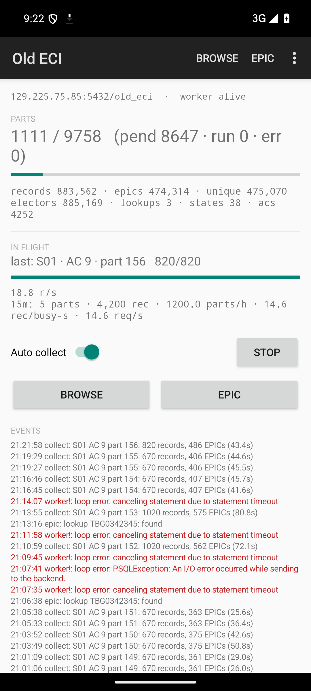

# Old Roll Collector — Android APK

The Android twin of the `old_eci` web app: a **standalone collector** that hits
the ECI eroll-2003 gateway directly from the phone and writes the same shared
Postgres database (`old_eci`) the PC web app uses. Phone and PC are
interchangeable workers over one ledger.



## What it does

| Screen | Capability |
|---|---|
| **Main (dashboard)** | live KPIs (parts done/total, electors, unique EPICs, request rate, 15m speed window, ETA), auto-mode switch, Start/Stop service button, activity feed (same `events` table as the web UI) |
| **Browse** | pick state → AC → part; seed states/ACs (merged legacy geo + live gateway, batched upsert), discover parts (chunked, floor semantics, hard cap), parts list with ✓/offset/current-part join, per-part Collect/Force/Cancel dialog, **CSV export** |
| **EPIC** | live encrypted EPIC lookup against the gateway (cache + bypass), rendered voter card, lookup history from `epic_lookups` |
| **Settings** | workers/floor/cap/calibrate, DB endpoint test/save, battery-optimization opt-out |

Auto mode is cooperative: the app enqueues `collect_auto` jobs into the shared
`jobs` table (same queue the web app consumes) and runs its own worker loop
with `FOR UPDATE SKIP LOCKED` claiming, so multiple devices coexist safely.

## Architecture

```
android/app/src/main/java/com/oldroll/collector/
  Db.java             JDBC layer + tiny borrow/give pool, schema fast-path, DDL
                      identical to work/old_eci/db.py, settings/events helpers,
                      stream() for large result sets (server-side cursor)
  Gateway.java        eroll-2003 POST client (3-attempt/429 backoff),
                      probeRollEnd, state/AC/part catalogue — mirrors client.py
  Worker.java         claim/finish/progress, stale-only orphan reclaim, seeding,
                      part sweeps, auto mode, EPIC job runner
  CollectorService    dataSync foreground service (id 417), partial wake lock,
                      3s progress notification + listener bus
  MainActivity        dashboard; auto-switch has a 5s anti-revert guard so an
                      async DB write can't flip the user's toggle back
  SelectActivity      Browse screen + job enqueue + CSV export
  CsvExport           streaming twin of GET /api/export.csv (same query/columns/
                      BOM/filename), MediaStore Downloads on API 29+
  EpicCrypto          gpk AES-GCM + RSA-OAEP (SHA-256/MGF1) lookup crypto,
                      embedded keys from work/app_keys.json, ~1.1s throttle
  EpicActivity / SettingsActivity / Labels / Json
```

## Build & install

Requirements: JDK 17+, Android SDK (compileSdk 35, minSdk 26), Gradle 8.x.

```bash
cd android
gradle assembleDebug          # or: gradle installDebug with a device attached
adb install -r app/build/outputs/apk/debug/app-debug.apk
adb shell am start -n com.oldroll.collector/.MainActivity
```

First launch creates the schema (fast-path catalogue check: skips DDL when the
tables already exist, so it never takes ACCESS-EXCLUSIVE locks against a live
PC worker). Tap **Start** to run the foreground service; grant the
notification permission when asked.

## The patched pgjdbc jar

Stock `org.postgresql:postgresql:42.7.4` **crashes on Android**:
`PGPropertyMaxResultBufferParser.adjustResultSize` calls
`java.lang.management.ManagementFactory`, which does not exist on Android, so
`PGStream.setMaxResultBuffer` throws `NoClassDefFoundError` during `tryConnect`
— and because it is an `Error`, it killed the whole process. No URL property
avoids it.

`libs/postgresql-42.7.4-android.jar` is the unmodified upstream jar with **two
classes recompiled** (sources kept in `libs/patched/`):

1. `PGPropertyMaxResultBufferParser.java`:
`ManagementFactory` usage removed in favour of a fixed `HEAP_CAP_BYTES =
512MB` constant (the default property path still yields `-1`, i.e. the same
unlimited buffer as upstream).
2. `BatchResultHandler.java` (added 2026-10-07): upstream builds batch
failures with the Java-9-only constructor
`BatchUpdateException(String,String,int,long[],Throwable)`, which is absent
on ART — the FIRST failed batch request therefore crashed the worker with
`NoSuchMethodError` *instead of showing the real server error*. The patched
class uses the JDBC-4 `BatchUpdateException(String,String,int,int[])`
constructor (present on every Android API ≥ 11) and attaches the cause with
`initCause`, so the underlying server error (duplicate key, our discover
INSERT column bug, …) surfaces normally. `CallableBatchResultHandler` does
not use the Java-9 constructor and needed no change.

Rebuild them by compiling both files against the stock jar (checker-qual on
the classpath) and running `jar uf`. Verify with:

```bash
unzip -l libs/postgresql-42.7.4-android.jar | grep MaxResultBuffer   # class present
javap -c -p -cp libs/postgresql-42.7.4-android.jar \
  org.postgresql.core.PGPropertyMaxResultBufferParser | grep -c ManagementFactory   # 0
javap -c -p -cp libs/postgresql-42.7.4-android.jar \
  org.postgresql.jdbc.BatchResultHandler | grep -c 'long\[\], java.lang.Throwable'  # 0
```

As defence in depth every background thread catches `Throwable`, so even a
surviving `Error` can never take the service down silently.

## Coexistence with the PC web app

* Jobs are claimed with `FOR UPDATE SKIP LOCKED` — two workers never duplicate a
  part; completed parts upsert idempotently on `source_id`.
* After a crash the phone only reclaims **stale** orphans (10 min parts /
  30 min jobs), so it never steals the PC's live work.
* Schema DDL is guarded by the catalogue fast-path above.

## CSV export notes

* Same query, column order, UTF-8 BOM and filename scheme as
  `/api/export.csv` (`epics_<state>_AC<ac>[_P<part>].csv`).
* Rows are **streamed** through a server-side cursor (`Db.stream`) straight into
  the file — the uplink to the remote DB is only ~0.3 MB/s and a full AC is
  70k+ rows, so materializing everything first overran the 120 s
  `statement_timeout` (killed mid-query) and risked OOM. The stream sets
  `statement_timeout=0` only for its own transaction.
* On API 29+ the file goes through MediaStore into `Downloads/` (no permission).
  Some builds reject the public `display_name` column with
  `IllegalArgumentException: Invalid column display_name`; the exporter falls
  back to the raw `_display_name` column automatically. The MediaStore row is
  inserted before the query runs, so the file appears while it fills; a failed
  export deletes the partial file.
* Success/error are reported as a toast **and** an `events` row (`source=
  export`), so runs are auditable from the web UI.

## Permissions

`INTERNET`, `ACCESS_NETWORK_STATE`, `FOREGROUND_SERVICE` +
`FOREGROUND_SERVICE_DATA_SYNC`, `WAKE_LOCK`, `POST_NOTIFICATIONS`,
`REQUEST_IGNORE_BATTERY_OPTIMIZATIONS` (the Settings screen offers the
opt-out intent — without it Doze will throttle long collection runs).

## Verified on device (API 35 emulator)

* Foreground service start/stop, notification ticker, survives reboot.
* Seeding, part discovery, manual + auto collection writing to `old_eci`
  alongside the PC worker (same part raced once — identical row counts).
* Auto toggle round-trip (off→on→off→on) with the anti-revert guard; DB
  `auto_enabled` matches the switch after every tap.
* EPIC live lookup matches Python ground truth (`app_search.py`), cache +
  bypass, history persisted.
* CSV export: 72,333-row file for S01 AC1, byte-verified against the DB
  (row count, BOM, header, sample rows incl. Telugu columns).
